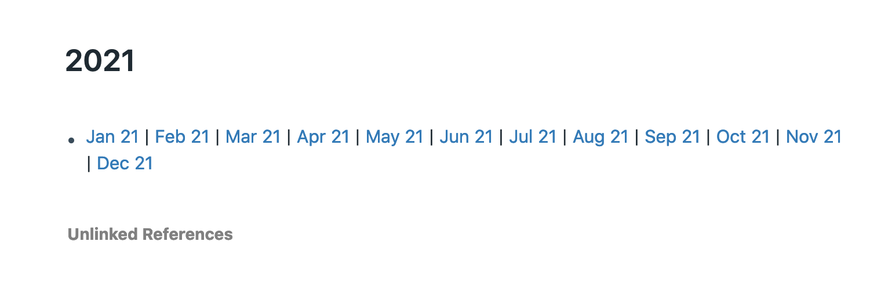

# Personal tools for Roam Research

## Overview

These tools are not supported, but you're welcome to use them.

### License

These tools are public domain.

## Tools

### Roam Month

Spit out a `{{table}}` that contains a calendar. Specify a month, or print out the current month if blank.

E.g.

- `roam-month` - render the current month
- `roam-month 2020/07` - render July, 2020
- `roam-month 2020/07/01` - render July, 2020

### Roam Day Miner

Mine the day pages for nodes matching a pattern and render `{{embed: (())}}` nodes for each block reference that matches

You must export your DB as JSON for this to work

E.g.

- `roam-mine-daily -f my-db.json -m 2020/07 -s "[[DONE]]" -a` - Show all completed TODOs for July, 2020

### Roam Importable Year

Spit out an importable JSON file corresponding to a year. Built along the lines of the technique posted in this forum thread: [How I quickly navigate in time](https://web.archive.org/web/20210228071506/https://forum.roamresearch.com/t/how-i-quickly-navigate-in-time/610).

Includes:
- A year page, e.g. `[[2021]]`
- Month pages, e.g. `[[January, 2021]]`
- Week pages, e.g. `[[Week 1, 2021]]`

Results in:

#### Year

#### Day

#### Month

#### Week

All interconnected

E.g.

- `roam-importable-year 2021 > 2021.json`
